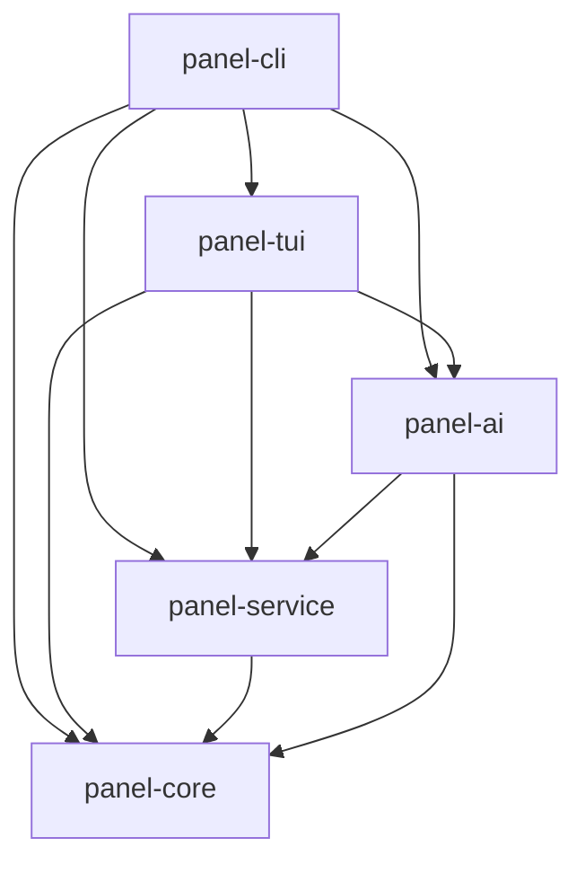
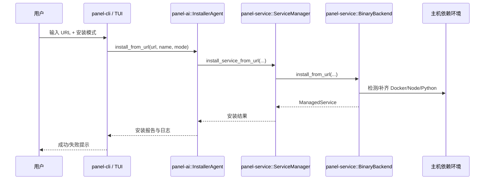

# Panel1 - Linux 服务器管理面板

一个现代化的 Linux 服务器管理面板，提供极简 TUI（监控 + AI 安装 Agent）。

## 特性

- **🖥️ TUI 终端界面** - 交互式命令行操作体验
- **🤖 AI 安装 Agent** - 输入 URL 自动安装工具服务（失败自动重试）
- **📦 单二进制部署** - 无需依赖，开箱即用

## 安装

### 一键安装（Linux，推荐）

```bash
curl -fsSL https://raw.githubusercontent.com/Gyv12345/panel1/main/install.sh | bash
```

指定版本安装：

```bash
curl -fsSL https://raw.githubusercontent.com/Gyv12345/panel1/main/install.sh | bash -s -- --version v0.1.0
```

### 从 GitHub Releases 下载

```bash
# 下载最新版本（Linux x86_64）
wget https://github.com/Gyv12345/panel1/releases/latest/download/panel1-0.1.0-x86_64-unknown-linux-musl.tar.gz

# 解压
tar -xzf panel1-0.1.0-x86_64-unknown-linux-musl.tar.gz

# 安装
sudo cp panel1-0.1.0-x86_64-unknown-linux-musl/bin/panel1 /usr/local/bin/
```

### 从源码编译

```bash
git clone https://github.com/Gyv12345/panel1.git
cd panel1
cargo build --release
sudo cp target/release/panel1 /usr/local/bin/
```

## 使用方法

```bash
# 启动 TUI 界面（默认）
panel1

# 启动极简 TUI（两页：监控 / AI 安装）
panel1 tui

# 查看系统状态
panel1 status

# 通过 URL 安装工具（Agent 模式）
panel1 install https://example.com/tool.tar.gz
panel1 install https://example.com/my-tool --name my-tool
panel1 install https://example.com/compose.zip --mode docker
panel1 install https://example.com/tool.tar.gz --verbose

# AI 配置（首次推荐执行）
panel1 ai seed-presets
panel1 ai config
panel1 ai show
panel1 ai set-model deepseek-chat
panel1 ai profiles list
```

## AI 模型配置

- Panel1 会把 AI 配置持久化到：`~/.panel1/ai.toml`
- 支持多个 `profiles`，可随时切换 active profile
- 首次执行安装命令且未配置时，会提示你是否立即配置
- 配置一次后，后续不需要重复输入

### 配置命令

```bash
# 交互式配置（推荐）
panel1 ai config

# 导入内置模型模板（多 profile）
panel1 ai seed-presets

# 非交互配置（适合脚本）
panel1 ai config \
  --profile deepseek-prod \
  --protocol openai \
  --base-url https://api.example.com/v1 \
  --api-key sk-xxxx \
  --model deepseek-chat

# 从内置模板创建 profile
panel1 ai config \
  --profile kimi-prod \
  --preset moonshot-kimi-k2-5 \
  --api-key sk-xxxx \
  --activate

# 使用智谱国内版 GLM-5 预设
panel1 ai config \
  --profile zhipu-plan \
  --preset zhipu-plan-cn \
  --api-key sk-xxxx \
  --activate

# 查看当前配置（API Key 自动脱敏）
panel1 ai show

# 仅切换模型
panel1 ai set-model qwen-plus

# profile 管理
panel1 ai profiles list
panel1 ai profiles use deepseek-chat
panel1 ai profiles remove old-profile
```

### TUI 快速切换

在 TUI 的 AI 安装页中：
- `Tab / ↑↓` 切换输入焦点
- 焦点在 `AI Profile` 时可用 `←→` 切换 profile
- 也可按 `p` 快速切换 profile（会持久化保存）

### 可用协议

- `openai`：OpenAI 兼容协议（国内大多数模型网关）
- `anthropic`：Anthropic 兼容协议

### 内置模型模板

内置模板参考 OpenClaw Wizard 的 Provider 指引，预置了常见组合（可自行修改）：

- `openrouter-claude45`
- `openrouter-deepseek-r1`
- `moonshot-kimi-k2-5`
- `moonshot-cn-kimi-k2-5`
- `minimax-m2.5-anthropic`
- `deepseek-chat`
- `deepseek-reasoner`
- `qwen-plus`
- `zhipu-plan-cn`（`glm-5`，Anthropic 协议，`https://open.bigmodel.cn/api/anthropic`）
- `glm-4.5`

### 环境变量（`PANEL1_AI_*`）

当设置以下变量时，会覆盖本地配置文件：

- `PANEL1_AI_PROTOCOL`：`openai` 或 `anthropic`
- `PANEL1_AI_BASE_URL`：模型服务地址（可选）
- `PANEL1_AI_API_KEY`：访问密钥
- `PANEL1_AI_MODEL`：模型名称

兼容性说明：当前版本仍兼容旧变量（`CLAUDE_*` / `ANTHROPIC_API_KEY` / `OPENAI_API_KEY`），但推荐统一使用 `PANEL1_AI_*`。

## TUI 界面

| 快捷键 | 功能 |
|--------|------|
| `1` | 服务器监控 |
| `2` | AI 安装 Agent |
| `Tab` / `↑↓` | AI 页切换输入项 |
| `m` / `←→` | 切换安装方案（auto/panel1/docker）或 AI Profile |
| `p` | 快速切换 AI Profile |
| `Enter` | 提交 URL 并自动安装 |
| `?` | 帮助 |
| `q` | 退出 |

## 安装说明

`panel1 install <url>` 会自动执行：
1. 下载文件
2. 识别归档并尝试解压
3. 分析并自动补齐依赖（Docker/Node/Python）
4. 自动重试和基础自修复
5. 写入本地服务目录并设置可执行权限

## Linux 兼容性

- 发行包优先使用 `musl` 静态构建（兼容性更高），并回退 `gnu` 构建。
- 当预编译包不可用时，安装脚本可回退到 `cargo` 源码构建。

## 项目结构

```
crates/
├── panel-core/      # 核心库（系统信息、服务管理）
├── panel-service/   # URL 安装与服务托管
├── panel-ai/        # 安装 Agent
├── panel-tui/       # TUI 终端界面
└── panel-cli/       # CLI 入口
```

## 架构图

### Workspace 依赖关系



### 安装链路（panel1 install / TUI 安装）



> 说明：`mode=auto` 会自动检测依赖；`mode=panel1` 偏向二进制直装；`mode=docker` 强制 Docker 路径并优先检查 Docker 环境。

## 开发

```bash
# 开发模式运行
cargo run

# 运行测试
cargo test

# 代码检查
cargo clippy

# 格式化
cargo fmt
```

## License

MIT
